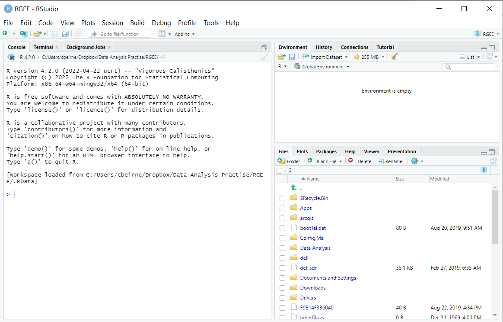
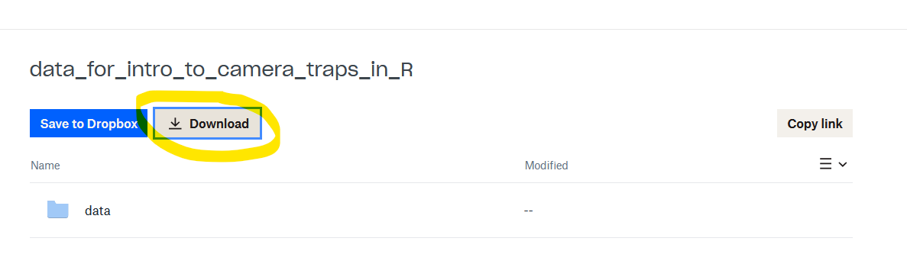

---
output:
  pdf_document: default
  html_document: default
---
# Preparing for the course {#prep}

In order reproduce the data management and analysis examples detailed in this book, you will need to take the following steps. 

- Install R
- Install R Studio
- Install associated R packages
- Create an R project
- Put the example data in the R project

The steps to do this are outlined below:

If you get stuck [send me an email!](mailto:c.w.beirne@gmail.com)

## Install R

**Windows** Click on [this link](https://cran.r-project.org/bin/windows/base/) and then `Download R-4.2.1 for Windows`.

**Mac** Click on [this link](https://cran.r-project.org/bin/macosx/) and then the `R-4.2.1.pkgs` link.

**If you already have R**  please update your R client so that it is on at least version 4.2.1. Checkout the [installR package](https://www.r-project.org/nosvn/pandoc/installr.html) to this directly from the terminal.

## Install RStudio

Through the course we will use RStudio to interact with R. Please download `RStudio Desktop` (Free) from the [RStudio website](https://www.rstudio.com/products/rstudio/download/). Alternatives to RStudio exist and we are happy if you want to use one of those instead!

**Installation check**

Open RStudio. If all has gone well you should see something like this:

```{r, echo=F, message=F, warning=F, out.width="100%"}

```


## Install the required packages

The next step is to install the packages required for the course. We need to do this in two steps: first, install packages which are on CRAN (the Comprehensive R Archive Network), and then install those which are not. 

Finally, we have provided the links to install and setup R Google Earth Engine (`rgee`). This is an optional step for advanced users only - we will not be using it in the course!

### CRAN packages
Copy and paste the following code into your R terminal and press enter. *Note - if you hover over the code block a copy button appears in the top right.*

```{r, echo=T, eval=F, class.source="Rmain"}
# A list of the required packages
list.of.packages <- c("activity",
                      "corrplot",
                      "cowplot",
                      "dplyr", 
                      "elevatr",
                      "gfcanalysis",  
                      "ggplot2",
                      "gridExtra",
                      "iNEXT",
                      "kableExtra",
                      "Hmsc",
                      "leaflet",
                      "lme4",
                      "lubridate",
                      "magrittr",
                      "MCMCvis",
                      "MODISTools",
                      "osmdata",
                      "pals",
                      "plotly",
                      "remotes",
                      "rmarkdown",
                      "sf",
                      "spOccupancy",
                      "stars",
                      "stringr",
                      "terra",
                      "tibble",
                      "tidyr", 
                      "unmarked",
                      "viridis",
                      "jtools",
                      "vegan",
                      "MuMIn",
                      "rgdal",
                      "usedist",
                      "taxize")

# A check to see which ones you have and which are missing
new.packages <- list.of.packages[!(list.of.packages %in% installed.packages()[,"Package"])]

# Code which tells R to install the missing packages
if(length(new.packages)) install.packages(new.packages)
lapply(list.of.packages, require, character.only = TRUE)
```

### Other packages
Some packages must be compiled from sources other than CRAN. Copy and paste following code block into your R console and press enter.

```{r, echo=T, eval=F, class.source="Rmain"}
# We use the remotes package to access package repositories not on the 
# CRAN interface (e.g. on github)
library(remotes)

remotes::install_github("RS-eco/traitdata")
remotes::install_github("arcaravaggi/remBoot")
remotes::install_github("annam21/spaceNtime")


```

## Create an R project

If you do not already work within R projects - you should! It allows you to work on multiple projects at the same time, and makes specifying file paths much simpler. Finally, if you want to incorporate GiHub into your workflows in the future, the use of R Projects is essential!

To create an R project for this course:

**Step 1**  Click on `File` -> `New project`

```{r, echo=F, message=F, warning=F, out.width="50%"}
knitr::include_graphics("images/course-preparation/new_project.png")
```

**Step 2**  Click `New Directory`

```{r, echo=F, message=F, warning=F, out.width="75%"}
knitr::include_graphics("images/course-preparation/New_directory.png")
```

**Step 3**  Then click `New Project` 

```{r, echo=F, message=F, warning=F, out.width="75%"}
knitr::include_graphics("images/course-preparation/new_project_2.png")
```

**Step 4**  Give your project a name and choose a folder to save it in (you do not have to copy the options here):

```{r, echo=F, message=F, warning=F, out.width="75%"}
knitr::include_graphics("images/course-preparation/project_name.png")
```

**Step 5**  Then click `Create Project`

The best thing about R Projects is that all the files contained within it can be specified relative to the project folder - no more long file paths to deal with! Currently the 'Files' tab in the bottom right should be empty (aside from the `.rproj` file):

```{r, echo=F, message=F, warning=F, out.width="75%"}
knitr::include_graphics("images/course-preparation/file_window.png")
```

Take note of the file path in the image above. For me it is `C:/Users/Dropbox/wildco_R_course` as this is where you will copy the data files to in later steps. You can also go straight to the root directory the project by clicking the three dots to the right of the file path in the `Files` tab!

Next, lets download the data files we need for this course!

## Download the data files

**Step 1**  Click on the following dropbox link:

[Data Management and Analysis Files](https://www.dropbox.com/sh/y014wzonjbz19p4/AAD9LsHi_SOrKsxmPQi2bLooa?dl=0)

**Step 2**  Click download:


```{r, echo=F, message=F, warning=F}

```

**Step 3**  Extract the files (it doesn't matter where to), then open the `data_for_intro_to_camera_traps` folder and copy the `data` folder it contains.

```{r, echo=F, message=F, warning=F, out.width="75%"}
knitr::include_graphics("images/course-preparation/copy.png")
```

**Step 4**  Then paste the data folder into your newly created R project folder. 

```{r, echo=F, message=F, warning=F}
knitr::include_graphics("images/course-preparation/paste_files.png")
```

**Step 5**  If everything has worked, your `Files' window in R Studio should now look like this: 

```{r, echo=F, message=F, warning=F, out.width="80%"}
knitr::include_graphics("images/course-preparation/final_files.png")
```

And you are ready for the course!

## The example datasets 

If you navigate through `data > raw_data` you will see that there are two files. One called `example_data` the other called `your_data`. They are summarised below:

### example_data

We have provided a subset of data derived from the [WildCo Lab](https://wildlife.forestry.ubc.ca/)'s "Algar Restoration Project". In the interest of teaching and code processing times, we have not provided a full dataset. Rather the data represent a sub-sample of sites (38 of 73 available) and years (2 of 4 available).

If you want more information on this project, see the following papers (and the archived datasets they contain):

[Tattersall, E. R., Burgar, J. M., Fisher, J. T., & Burton, A. C. (2020). Mammal seismic line use varies with restoration: Applying habitat restoration to species at risk conservation in a working landscape. Biological Conservation, 241, 108295.](https://www.sciencedirect.com/science/article/abs/pii/S0006320719307013)

[Tattersall, E. R., Burgar, J. M., Fisher, J. T., & Burton, A. C. (2020). Boreal predator co‐occurrences reveal shared use of seismic lines in a working landscape. Ecology and Evolution, 10(3), 1678-1691.](https://onlinelibrary.wiley.com/doi/full/10.1002/ece3.6028)

[Beirne, C., Sun, C., Tattersall, E. R., Burgar, J. M., Fisher, J. T., & Burton, A. C. (2021). Multispecies modelling reveals potential for habitat restoration to re‐establish boreal vertebrate community dynamics. Journal of Applied Ecology, 58(12), 2821-2832.](https://besjournals.onlinelibrary.wiley.com/doi/abs/10.1111/1365-2664.14020)

[Burton, A. C., Beirne, C., Sun, C., Granados, A., Procko, M., Chen, C., ... & Burgar, J. (2022). Behavioral “bycatch” from camera trap surveys yields insights on prey responses to human‐mediated predation risk. Ecology and evolution, 12(7), e9108.](https://onlinelibrary.wiley.com/doi/full/10.1002/ece3.9108)

[Sun, C., Burgar, J. M., Fisher, J. T., & Burton, A. C. (2022). A cautionary tale comparing spatial count and partial identity models for estimating densities of threatened and unmarked populations. Global Ecology and Conservation, 38, e02268.](https://www.sciencedirect.com/science/article/pii/S2351989422002700)

[Sun, C., Beirne, C., Burgar, J. M., Howey, T., Fisher, J. T., & Burton, A. C. (2021). Simultaneous monitoring of vegetation dynamics and wildlife activity with camera traps to assess habitat change. Remote Sensing in Ecology and Conservation, 7(4), 666-684.](https://zslpublications.onlinelibrary.wiley.com/doi/10.1002/rse2.222)

### your_data

The `your_data` folder contains files I have provided. This is the subset of an unpublished (and as yet un-analysed) dataset. I will leave it to you to find out more about it during the course!

You can replace this data set with your own if you wish. If you want to use your own data it *MUST* be in 'Wildlife Insights' format - see the descriptions [here](https://docs.google.com/spreadsheets/d/1Jg-WybmVeGlWGrbPpwuwJCgranOV1r3M_LrzELttfK0/edit?usp=sharing) and for a existing example/template see [here](https://drive.google.com/drive/folders/1MeCeoXepyee7mADlxQZ2k0bjVBOTP5m7?usp=sharing). *NOTE* delete the description row if you are using your own data.  

The green/bolded columns shown in the template example are the **absolute minimal essential columns** - you can have more columns with other information! 

## Practise before the course

Finally, if you want to practice your R skills before the course, here are two (of many) great resources out there:

[R Programming for Beginners | Complete Tutorial | R & RStudio](https://www.youtube.com/watch?v=BvKETZ6kr9Q) - Some great introductory videos to working in R

[Modern R with the tidyverse](https://b-rodrigues.github.io/modern_R/) - A book introducing tidyverse data manipulation
