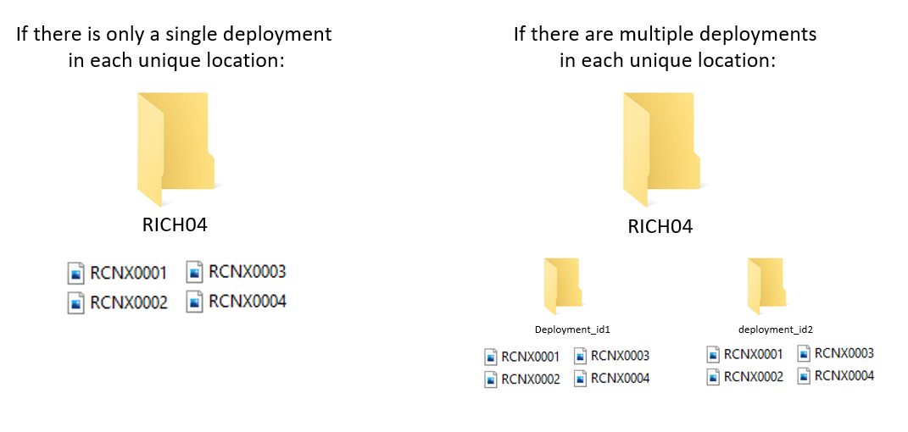

# Preprocessing and labelling

Once you have deployed your camera traps and brought your SD cards. We have several steps we need to perform before we can start analyzing the data:

- backup the data
- preprocess the files
- label the footage
- update deployment end dates

We summarise each step below and point to useful tools where necessary.

## Data storage

The file structure of your data backups depends on the structure of your project. We use one of two different options, which each have their merits:

1) Location based

This is likely the most intuitive method if you are manually sorting data or using an image labeller (software to manage your camera data) which uses the location as the key organizing element. You would make a folder using the 'placename' (unique location where a camera is deployed), then copy all of the data relating to that site within it (left). Note, if you had multiple camera deployments you would have nested folders with the 'deployment_id' as the name: 

```{r, echo=F, message=F, warning=F}

```

2) Deployment based

Increasingly camera trap management platforms are 'deployment' driven rather than location based (e.g. Wildlife Insights). In this instance, the images are placed within a folder named with the `deployment_id` (the unique code corresponding to that deployment), typically within a single folder.

In this scenario, we would have a folder called 'to upload' with all of the unique deployment folders within it. Then, once the folder has been upload to the platform, then the folder is moved to an "uploaded" folder:

. 
**TO DO**

Crucially - make redundant copies to ensure you do not lose data. We make both local and cloud-based copies of our data sets.  

## Preprocessing

The follow steps represent optional next steps to apply to your data. Whether you need them depends on your questions, the platform you are using to label your data, and even the volume of images you will be processing.

### Renaming

When a camera takes images, it applies sequential names which are duplicated across cameras (e.g. RCNX0001, RCNX0002 etc). In the future, if files are accidentally moved it would be difficult (if not impossible) to trace them back their origin. One way to get around this is to rename every camera image with a unique code (e.g. placename_datetime) which will ensure that line of data you generate can be traced back to an image, regardless of how it is stored. 

We have created a tool which can be applied to folders of images organised by location and deployment, to create unique codes for each image:[the WildCo Image Renamer](https://github.com/WildCoLab/WildCo_Image_Renamer). The repository has an example dataset which you can play around with to get familiar with the tool.

### Automated Labelers

Once you have backed up and renamed your images, you may want to process them with an Artificial Intelligence (AI) labeler. Although they are very much trendy and in vogue right now, whether you use one or not should be a balanced decision based on:

- The number of image you have to process - if you only have a small dataset, it is likely easier to do manually
- AI labelers are not perfect, and if they havent been validated in your survey location then use caution when applying it. For example, an AI algorythmn developed from terrestrial camera traps will likely not work well on an arboreal dataset
- For AI labelers to run quickly, you may need some very expensive computer gear. It is not a given that it will be cheaper than manual labor
- The resolution of labels you need - AI labelers are getting pretty good at sifting out blank images, but they have a long way to be before they can reliably split ground squirrel (*Urocitellus sp**)species, or long-nosed armadillo species (**Dasypus sp.**) 

For a very pragmatic and informed take on the current state of the art, see Saul Greenberg's [Automated Image Recognition for Wildlife Camera Traps: Making it Work for You.](https://wildcams.ca/site/assets/files/1389/2020-08-greenberg-imagerecognitioncameratraps_updated.pdf) report.

One of the biggest players in the game is undoubtedly [Megadetector](https://github.com/microsoft/CameraTraps/blob/main/megadetector.md). Click the link for an overview of the machine learning model and how it might work for you. 

Finally, some platforms now have their own inbuilt labeling AI (e.g. Wildlife Insights), which is much more accessible than developing your own. Our only advice is be weary of the identifications they generate and always check your data (a.k.a. keep a human in the loop)!

### Sensitive images

One of the key benefits to AI labelers is you can use them to remove sensitive information (such as peoples identities) from images without ever looking at them. An example of this would be camera trapping in protected areas where it is not possible to ask every person if they are happy being photographed for science. Instead, we can use megadetector (or another AI labeler) to tell us when a human is detected in an image, then blur the area of that photo to remove individually identifying information. 

The WildCo lab has developed a tool to blur human images using Megadetector outputs: [WildCo_Face_Blur](https://github.com/WildCoLab/WildCo_Face_Blur). Click the link for details on how to use it.

```{r, echo=F, message=F, warning=F}
knitr::include_graphics("images/preprocessing/human_blur.jpg")
```

### Timelapse extraction

Timelapse photographs can be critical to determine when cameras are functioning, particularly in low productivity environments where wildlife detections are rare. They can also be used to generate site-level vegetation indices, such as NDVI, as they are taken at the same time every day. As, you probably don't want to be sorting through thousands of images of leaves and grass, or you want to extract the images to run through a different program (e.g. `phenopix` package - see [the covariates chapter](#covariates)). Also, the detection process is fundamentally different to that of a motion activated image, so they shouldn't really be included in your analysis (see [the density chapter](#density) for more discussion on motion vs. timelapse images...

To quickly extract timelapse images we develop some code which uses the metadata of the images to filter out timelapse photos from motion detected photos. It is packaged up as part of the [WildCo_Image_renamer](https://github.com/WildCoLab/WildCo_Image_Renamer) script. 

## Labelling

We often get asked what the best software/data platform is for labeling images... and the pragmatic answer is that it does not matter as long as you export your data in a standardised format. The truth is that different projects have different needs: you may not have reliable internet so need to use an offline software, such as Timelapse, might be best. Or perhaps you may work internationally as part of a large team of labelers so an online platform, such as Wildlife Insights, is essential. 

Dan Morris has curated a fantastic list of currently available tools here: [Everything I know about machine 
learning and camera traps](https://agentmorris.github.io/camera-trap-ml-survey/).

```{r, echo=F, message=F, warning=F, out.width="100%"}
knitr::include_graphics("images/preprocessing/labelers.png")
```


In a nutshell:

**Data platforms** are web- and desktop-based tools used for efficient and standardized data management, sharing, and analysis of remote camera data. A number of platforms exist so it is important that users choose the one best suited to their needs. To help camera trap users make this decision, [the Wildcam network](https://wildcams.ca) has developed a comparison of different camera data platforms. It provides an overview of platforms and software used in remote camera research in western Canada. As software and online tools are often subject to frequent updates and change, we recognize this as a document subject to change over time. [Click here](https://wildcams.ca/site/assets/files/1389/overviewofcamerawebsites_draft_2020-06-17.xlsx) to review the comparison (last updated June 2020). We welcome feedback at any time (info@wildcams.ca)

**Software** are programs specifically designed for camera trap photos and their associated data is now recognized as the best method for data processing. There are quite a few programs available for practitioners, but many of them have most of the same functionalities. The relatively few unique features that distinguish programs will help to determine what software to use, and what features are needed for specific studies will vary depending on their study designs. See:

[Wearn, O. R. and P. Glover-Kapfer. 2017. Camera-trapping for conservation: a guide to best-practices. WWF conservation technology series 1.1 181.](https://www.researchgate.net/publication/320402776_Camera-trapping_for_conservation_a_guide_to_best-practices)

[Young, S., J. Rode‐Margono and R. Amin. 2018. Software to facilitate and streamline camera trap data management: a review. Ecology and Evolution, 8: 9947-9957.](https://onlinelibrary.wiley.com/doi/full/10.1002/ece3.4464)

## End dates and outages

It is very important to note that camera deployments do not end when you pickup the camera - they end when the camera **stops collecting comparable data**. The best time to record date a cmaera stops functioning probably is when you are labelling images. Do not cut this corner!
