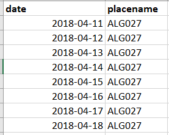
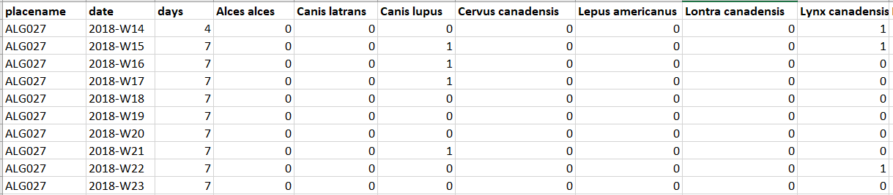

# Error checking {#error-checking}

The most important part of analyzing camera trap data is checking and exploring your data!
Based on the projects we have worked on synthesizing multiple datasets from different sources... camera trappers are not doing a very good job of checking for errors.

Working in R makes it possible to rapidly check your data, ideally in almost real time as you collect it.
In an ideal world it would be worth downloading the data for your project at least once per month and checking that 'everything' looks good.
But what constitutes 'everything'?

## Standardised exploration script

In the Wildlife Coexistence Lab developed a standardized R script to check the data generated by camera trap projects.
This script is kept on our [WildCO Single Site Exploration GitHub page](https://github.com/WildCoLab/SingleSiteExploration).

Below we run through the important elements of checking camera trap data, and where they is a coding skill fundamental to the process, we explore it in more detail (a.k.a. `skill checks`).

*Let's go!*

First, open the `.Rproj` file your created in the [course preparation section](#prep).
Then click

`File` -\> `New file` -\> `Rscript` (alternatively you can use the `R Markdown` option if you are comfortable with that)

After the file has opened, immediately save it as '01_example_error_checking_and_export.R\`.
We will usually make a new R sheet for each chapter - however the error checking and analysis data creation chapters should be in the same document.

Second, read in our standardized example datasets:

```{r ch3_1, class.source="Rmain"}
# Load your data 
pro <- read.csv("data/raw_data/example_data/projects.csv", header=T)
img <- read.csv("data/raw_data/example_data/images.csv", header=T)
dep <- read.csv("data/raw_data/example_data/deployments.csv", header=T)
cam <- read.csv("data/raw_data/example_data/cameras.csv", header=T)

```

Next, load in the packages we will use in this chapter - we give a brief description of them too.
Cut and paste the code block below.

```{r ch3_2, echo=T, results='hide',message=F, warning=F, class.source="Rmain"}
#Load Packages
list.of.packages <- c(
                      "leaflet",       # creates interactive maps
                      "plotly",        # creates interactive plots   
                      "kableExtra",    # Creates interactive tables 
                      "tidyr",         # A package for data manipulation
                      "dplyr",         # A package for data manipulation
                      "viridis",       # Generates colors for plots  
                      "corrplot",      # Plots pairwise correlations
                      "lubridate",     # Easy manipulation of date objects
                      "taxize",        # Package to check taxonomy 
                      "sf")            # Package for spatial data analysis 

# Check you have them in your library
new.packages <- list.of.packages[!(list.of.packages %in% installed.packages()[,"Package"])]
# load them
if(length(new.packages)) install.packages(new.packages,repos = "http://cran.us.r-project.org")
lapply(list.of.packages, require, character.only = TRUE)

```

## Adding a sampling site location column to the image data

Wildlife Insights is a "deployment" based image management platform, meaning all of the images are associated with a specific deployment (a single camera check period). Whilst this is great for management of images, it is less useful for analyses as we often have multiple deployments per sampling site (e.g. each time we retrieve the SD card should triggers a new deployment). Do not worry too much about this! Crucially What it means is there is not a sampling location identifier in your image data to group images across multiple deployments - so we should add one!

Do not worry, it is easy. In Wildlife Insights the sampling location is refereed to as the "placename".

```{r ch3_2a, eval =T, class.source="Rmain"}

# The following code matches every deployment ID in images, with deployment_id's and placenames in the deployment data. 
img <- left_join(img, dep[,c("deployment_id", "placename")])
```

We will experiment more with left joins later! Let's get into the code. 

## Formatting dates

Every aspect of camera trapping involves manipulating date objects - calculating how long cameras were active, when detections occurred, working with timezones etc.
Thus, as a camera trapper working in R you need to be comfortable dealing with them.

Fortunately the process has been made far easier with the `lubridate` package.

The first dates we need to convert are those in the deployment (`dep`) datasheet - the start and end times of each period of camera activity.
The way `lubridate` works is you specify the order of the days, months years, hours, minutes and seconds with the codes d,m,y,h,m, and s respectively.

### Skill check: `lubridate`

Try importing the 25th of December in a couple of formats.
Copy and run the following:

```{r ch3_3, eval =F, class.source="Rinfo"}
#library(lubridate)
# day-month-year
dmy("24-12-2022")

# year-month-day
ymd("2022-12-24")
```

The output should be identical.
Note `lubridate` defaults to UTC - unless otherwise specified.

Now the real power of `lubridate` lies in the fact that you can handle multiple different date formats in one column using the `parse_date_time()` function.
This sometimes happens - I usually blame excel - but you could be merging two data sets formatted in different ways too.
Lets try it:

```{r ch3_4, eval=F, class.source="Rinfo"}
x <- c("24-12-2022", "2022-12-24", "12-24-2022") #Three different date formats
parse_date_time(x, c("ymd", "dmy", "mdy"))
```

Again, they should give all the same output!

Next, lets calculate the amount of time which has elapsed between two dates.
A fundamental operation in the management of camera data.
To do this we first create an interval object `interval(date1, date2)`, then ask to return the object in days `/ddays(1)`.
Lets try it:

```{r ch3_5, eval=T, class.source="Rinfo"}
# Specify your start and end dates
start <- ymd("2021-10-13")
end <- ymd("2021-12-11")
```

```{r ch3_6, eval=F, class.source="Rinfo"}
# Specify the interval, and put it in days
interval(start, end)/ddays(1)

# Interval creates an "interval object" - run that along and see what it looks like
# ddays() converts the native units of date objects in R (seconds) to days - run it on its own to see.
```

How many days elapsed between those two dates?

We can change the units of the output by changing the denominator:

```{r ch3_7, class.source="Rinfo"}
# Specify the interval, and put it in weeks
interval(start, end)/ddays(7)
```

And in decimal years:

```{r ch3_8, class.source="Rinfo"}
interval(start, end)/ddays(365)
```

Easy!
If you want to learn more about the amazing functionality of the 'lubridate' package - check out the pdf [Lubridate Cheatsheet](https://rawgit.com/rstudio/cheatsheets/main/lubridate.pdf)

### Deployment dates

Lets get back to the camera data.
Which `lubridate` format should we use for `r dep$start_date[1]`?

`ymd()` should do the job.
Lets convert the date columns from character strings to date objects:

```{r ch3_9, class.source="Rmain"}
# start dates
dep$start_date <- ymd(dep$start_date)

# end dates
dep$end_date   <- ymd(dep$end_date)
```

Now lets make a new column in the deployment data called `days`, and calculate the interval for all the deployments:

```{r ch3_10, class.source="Rmain"}
dep$days <- interval(dep$start_date, dep$end_date)/ddays(1)
```

We should then check the range of dates the cameras were active for.
Things to look out for are:

**- 0's** A value of zero would mean a deployments which started and ended on the same day -\> it typically denotes a camera which malfunctioned instantly.

**- NA's** This is either an `end_date` which is NA e.g. if the camera was stolen, or it could be a date value which failed to parse e.g. if you had a typo in your date column such as `ymd("202-212-24")` it would return `NA`

**- Negative numbers** Are more common that you think... someone probably got the start and end dates the wrong way round when entering data.

Lets look at the range of values we have:

```{r ch3_11, eval=F, class.source="Rinfo"}
summary(dep$days)
```

Cameras were active between 15 and 234 days per deployment, and we have an NA.
Let's see what it relates to:

```{r ch3_12, class.source="Rinfo"}

dep[is.na(dep$days)==T,] %>% 
  kbl() %>% 
  kable_styling(full_width = T) %>% 
  kableExtra::scroll_box(width = "100%")
```

It was a camera that was on a 'HumanUse' feature - this camera was stolen!

### Image dates

We next need to convert the `img$timestamp` column.
What `lubridate` format is required for a a date which looks like **`r img$timestamp[1]`**?

```{r ch3_13, eval=F, class.source="Rinfo"}
ymd_hms("2015-11-21 03:03:44")
```

Lets apply this to our image dataset:

```{r ch3_14, class.source="Rmain"}
img$timestamp <- ymd_hms(img$timestamp)
```

And do a quick check to see if all the dates parsed correctly.
First check the range:

```{r ch3_15, class.source="Rinfo"}
range(img$timestamp)
```

We have data from early 2018 to late 2019.

And check for NA's:

```{r ch3_16, class.source="Rinfo"}
table(is.na(img$timestamp))
```

No NA's - great!

## Basic trapping summaries

Now that our camera trap data are loaded into R, we can very quickly find out summary information about the dataset.
These can feed directly into the methods section of your report/paper.

First let's count the number of unique locations:

```{r ch3_17, echo=T, class.source="Rinfo"}
# Count the number of camera locations
paste(length(unique(dep$placename)), "locations"); paste(length(unique(dep$deployment_id)), "deployments");paste(nrow(img), "image labels"); paste(nrow(img[img$is_blank == TRUE,]), "blanks")
```

## Error checks

Lets start with the fundamental error checks required with a new data set:

-   Camera locations
-   Deployment date checks
-   Image and deployment matching
-   Taxonomy
-   Diel time

### Camera locations

A common mistake in camera trap data sets is that the locations are not where they are supposed to be.
The safest way to check your data is to plot them... preferably R!
After synthesizing \>100 different projects from different data contributors for one project, we found \~20%(!) of submissions had a clear and obvious location errors (e.g. a camera station in the middle of the Atlantic).

Don't just take my word for it:

```{r ch3_21, echo=F,  out.width="50%"}
knitr::include_graphics("images/exploration/project_your_locations.PNG")
```

(p.s. [Mason is well worth a follow on Twitter](https://twitter.com/masonfidino) )

#### Skill check: Leaflet maps

Below we make use of the fantastic 'leaflet' package to produce interactive plots to help us check our camera locations.
`leaflet` has a tonne of different customization options and freely available, high resolution, base layers to choose from.

Note - Leaflet is best used using tidyverse 'pipe' notation - `%>%`.
It allows you to add successive operations in the order that the elements occur.

The simplest version of a leaflet map looks like this:

```{r map1, echo=T, class.source="Rinfo"}
m <- leaflet() %>%             # call leaflet
        addTiles() %>%         # add the default basemap
        addCircleMarkers(      # Add circles for stations
          lng=dep$longitude, lat=dep$latitude) 
m                              # return the map
```

This is great!
We can zoom in using the +/\_ in the top left hand corner, and the default basemap is OpenStreetMap.
The camera stations all appear to be in the right place (we don't have any in the Atlantic).

But wouldn't it be great to see the `dep$placename` when we click over a symbol?
Run the following:

```{r map2, echo=T, eval=F, class.source="Rinfo"}
m <- leaflet() %>%             
        addTiles() %>%         
        addCircleMarkers(      
          lng=dep$longitude, lat=dep$latitude,
          popup=paste(dep$placename)) # include a popup with the placename!
m                              
```

Okay, but a map isn't really useful until have have some satellite imagery, right?
Easy:

```{r map3, echo=T, class.source="Rinfo"}
m <- leaflet() %>%             
        addProviderTiles(providers$Esri.WorldImagery) %>% #Add Esri Wrold imagery         
        addCircleMarkers(      
          lng=dep$longitude, lat=dep$latitude,
          popup=paste(dep$placename)) # include a popup with the placename!
m                              
```

Zoom in - what can you tell me about where the stations are located?
Can you spot any differences between the stations?
*Clue: look for lines on the landscape*.

These lines are linear features related to oil and gas exploration, some cameras are deployed on them, others away from them.

#### Making corrections

As you can see, we have one deployment location that is a long way from the others. It almost looks like it belongs to another project?! Let's take a look at all of the deployments from that location (`ALG069`):

```{r corrections, echo=T, class.source="Rinfo"}
dep[dep$placename=="ALG069",c("deployment_id", "placename", "longitude", "latitude")]
```

It looks like there is a typo in one of the coordinates: -112.5075 -> -113.5075. Let's correct it:

```{r corrections2, echo=T, class.source="Rmain"}
dep$longitude[dep$placename=="ALG069"] <- -112.5075
```

#### The ultimate leaflet map

We will need to check our correction has worked. Let's also color camera locations based on their `dep$feature_type`, include them in the legend, and have their names show up when we click on them too!

```{r map4, echo=T, class.source="Rmain"}
# First, set a single categorical variable of interest from station covariates for summary graphs. If you do not have an appropriate category use "project_id".
category <- "feature_type"

# We first convert this category to a factor with discrete levels
dep[,category] <- factor(dep[,category])
# then use the turbo() function to assign each level a color
col.cat <- turbo(length(levels(dep[,category])))
# then we apply it to the dataframe
dep$colours <- col.cat[dep[,category]]

m <- leaflet() %>%
  addProviderTiles(providers$Esri.WorldImagery, group="Satellite") %>%  
  addTiles(group="Base") %>%     # Include a basemap option too
  addCircleMarkers(lng=dep$longitude, lat=dep$latitude,
                   # Co lour the markers depending on the 'feature type'
                   color=dep$colours,
                   # Add a popup of the placename and feature_type together 
                   popup=paste(dep$placename, dep[,category])) %>%
  
  # Add a legend explaining what is going on
  addLegend("topleft", colors = col.cat,  labels = levels(dep[,category]),
                   title = category,
                   labFormat = labelFormat(prefix = "$"),
                   opacity = 1) %>%
  
  # add a layer control box to toggle between the layers
  addLayersControl(
                    baseGroups = c("Satellite", "Base"))

m

```

If you click on a point you will see it's corresponding `placename` and `feature_type` - so you can find the problem data.
You can also check your treatment categories using the key.
If you zoom in, all the "offline" locations should be >100m away from a linear features, the other on top of them.

For more examples of leaflet in R, see [RStudio's leaflet tutorial](https://rstudio.github.io/leaflet/).

**Check the distance between camera pairs**

Sometimes the coordinates of a camera stations are accidentally repeated in the deployment data, which can actually be very hard to see on a map as the points will overlay perfectly.
The way we check this is to calculate the pairwise distance between all of the unique deployments in the project.
This helps us in two ways:

-   we can find "cryptic" duplication events in the deployment coordinates
-   this distance is often reported in manuscript method sections

In the following code block we make first use of the simple features (`sf`) package - tools which make spatial operations which you would normally perform in ArcMap very easy (e.g. plotting and manipulating polygons).
More on that later!

```{r ch3_22, class.source="Rmain"}
# create a list of all the non-duplicated placenames
camera_locs <- dep %>% 
  dplyr::select(placename, latitude, longitude) %>% 
  unique() %>% # remove duplicated rows (rows where the placename and coordinates match)
  st_as_sf(coords = c("longitude", "latitude"), crs = "+proj=longlat") # Convert to `sf` format
```

First lets check that none of the `placenames` are duplicated - this would suggest a placename with two sets of coordinates.
If all is well, this should return an empty dataframe.

```{r ch3_23, class.source="Rinfo"}
# Check that there are no duplicated stations
camera_locs[duplicated(camera_locs$placename)==T,]
```

If it returns a list of \<0 rows\>, we don't have duplicates with different coordinates.
Phew!

Now let's crunch the numbers.Paste and run the following:

```{r ch3_24, class.source="Rmain"}
# distance matrix for all cameras
camera_dist <- st_distance(camera_locs) %>% 
                  as.dist() %>% 
                  usedist::dist_setNames(as.character(camera_locs$placename)) %>% 
                  as.matrix()


#Make temporary camera_dist_mins by  converting diagonals/zeros to 999999 so we can avoid the zeros when using which.min function to find nearest cameras
camera_dist_mins <- camera_dist + diag(999999,dim(camera_dist)[1])

#Create new empty dataframe for appending results to
camera_dist_list <- data.frame(focal_cam = character(),nearest_cam = character(), dist = double())

#Cycle through each column of camera_dist_mins
for (i in (1:dim(camera_dist_mins)[1])) 
  {

    #Get index of minimum value of column i
    t <- which.min(camera_dist_mins[,i])

    #Combine relevant data into new_row
    new_row <- data.frame(colnames(camera_dist_mins)[i],names(t),camera_dist_mins[t,i])

    #Append the new_row to the accumulated results dataframe
    camera_dist_list[nrow(camera_dist_list) + 1,] = new_row

  }
```

Lets summarize the output:

```{r ch3_25, , class.source="Rinfo"}
summary(camera_dist_list$dist)
```

So the largest distance between two cameras is `r paste0(round(max(camera_dist_list$dist),0), "m")`, the minimum is `r paste0(round(min(camera_dist_list$dist)), "m")` and on average it is `r paste0(round(mean(camera_dist_list$dist)), "m")`.

Again, put that straight into the methods section of your report/paper.

#### Do all images have a deployment associated with them?

Another very useful check is to verify that all of the `placenames` have corresponding image data, and that all image data has corresponding deployment data!
You would be surprised how often this is not the case!

```{r ch3_26, class.source="Rmain"}
# check all check the placenames in images are represented in deployments
# This code returns TRUE if it is and FALSE if it isn't. We can then summarize this with table()
table(unique(img$placename) %in% unique(dep$placename))
```

We have 38 TRUE's, which means all the images have deployment data.

Let's check that all the placenames also have image data:

```{r ch3_27, class.source="Rmain"}
# check all the placenames in deployments are represented in the images data
table(unique(dep$placename)  %in% unique(img$placename))
```

Great.

If you see any FALSE observations - you either have image data or deployments missing.
Go back and check your raw data!

### Camera activity checks

The next step is to plot out the camera activity at each unique place name to see when our cameras are functioning.
To make this plot we will need to use the `plotly` package for the first time.
We use this because the plots are interactive, just like with leaflet we can zoom in and zoom out and find problem observations.
It also dynamically changes the y-axis and x-axis labels to fit the data, which is very useful!
Let's experiment with some basic 'plotly' graphs to get warmed up:

#### Skill check: plotly

If you are familiar with making plots in base R or ggplot, hopefully `plotly` is not too intimidating.

Let us start with a basic scatter plot using the deployment data.

```{r ch3_28, warning=F, message=F, class.source="Rinfo"}
library(plotly)
fig <- plot_ly(data = dep,                    # Specify your data frame
               x = ~longitude, y = ~latitude, # The x and y axis columns
               type="scatter",                # and the type of plot
               mode="markers")                # And the mode - other options = "lines+markers" or "lines"
fig
```

Like we said, this is very similar to conventional plotting tools.
However, things get different when we start to specify the style of the points.
In base R we might use `pch=` and `cex=` to change the style and size of the points, whereas with `plotly` we use the "marker" option, and include elements as a list.

```{r ch3_29, warning=F, message=F, class.source="Rinfo"}
library(plotly)
fig <- plot_ly(data = dep,                    
               x = ~longitude, y = ~latitude,
               color=~feature_type,              # We can specify color categories
               type="scatter",                # and the type of plot
               mode="markers",                # And the mode - other options = "lines+markers" or "lines"
               marker=list(size=15))             # the default size is 10           
fig

```

As ever- this just scratches the surface of the `plotly` package.
See the [Plotly graphing library](https://plotly.com/r/) for a wealth of options.

#### The ultimate plotly camera activity figure

In the following plot, black dots denote start and end dates, lines denote periods where a camera is active.
Each unique `placename` gets its own row on the plot - you can hover over the lines to get the `deployment_id`.

We will use a loop to build the different elements... you don't need to understand the code itself, just how to interpret the output.
Cut and paste the following:

```{r activity, echo=T, class.source="Rmain"}

# Call the plot
p <- plot_ly()

# We want a separate row for each 'placename' - so lets turn it into a factor
dep$placename <- as.factor(dep$placename)

# loop through each place name
for(i in seq_along(levels(dep$placename)))
  {
      #Subset the data to just that placename
      tmp <- dep[dep$placename==levels(dep$placename)[i],]
      # Order by date
      tmp <- tmp[order(tmp$start_date),]
      # Loop through each deployment at that placename
      for(j in 1:nrow(tmp))
      {
        # Add a line to 'p'
        p <- add_trace(p, 
                       #Use the start and end date as x coordinates
                       x = c(tmp$start_date[j], tmp$end_date[j]), 
                       #Use the counter for the y coordinates
                       y = c(i,i), 
                       # State the type of chart
                       type="scatter",
                       # make a line that also has points
                       mode = "lines+markers", 
                       # Add the deployment ID as hover text
                       hovertext=tmp$deployment_id[j], 
                       # Color it all black
                       color=I("black"), 
                       # Suppress the legend
                       showlegend = FALSE)
      }
      
  }
# Add a categorical y axis
 p <- p %>%   layout(yaxis = list(

      ticktext = as.list(levels(dep$placename)), 

      tickvals = as.list(1:length(levels(dep$placename))),

      tickmode = "array"))


p

```

**What do the gaps signify?** The breaks in the line signify periods when the camera at a location was not active.
You can see there was a point in 2018 when 9 out of 38 cameras had stopped working.

**Can you see any issues?** Yes!

Sometimes you will see a deployment a long way to the left or right of the plot, this is usually a date error (e.g. `ALG036`).

#### Corrections

We checked the original datasheets for `ALG036` and found out that the deployment end date for `ALG036_2019-04-04` was incorrectly entered. It was written as 2020 not 2019. Let's correct it: 

```{r ch3_31a, eval=T, class.source="Rmain"}
dep$end_date[dep$deployment_id=="ALG036_2019-04-04"] <- ymd("2019-11-21") 
                                    #remember to format it as a date object
```

### Detection check

Once we are happy that are cameras were functioning when we expected them to be, we now need to check if all of our labelled images fall within the associated deployment periods.
To do this we build on the previous plot above, but also add in the image data over the top.
This plot can get very messy, so we divide it into sections of ten deployments.

As before, black lines show an active camera.
Red dots show wildlife detection, blue dots blanks or NA's.

We only show the output of the first 30 deployments, but you should do this for every single deployment you have!

*Note - the code below is complex, you don't have to understand it all unless you want to*

```{r ch3_31, eval=F, class.source="Rmain"}
# Make a separate plot for each 30 stations 
# To do this make a plot dataframe
tmp <- data.frame("deployment_id"=unique(dep$deployment_id), "plot_group"=ceiling(1:length(unique(dep$deployment_id))/30))

dep_tmp <- left_join(dep,tmp, by="deployment_id")

# Make a colour palette for blanks vs. real detections
cols <- c("red", "blue")


for(i in 1:max(dep_tmp$plot_group))
{  
  # Call the plot
  p <- plot_ly() 
  
  #Subset the data to just that placename
  tmp <- dep_tmp[dep_tmp$plot_group==i,]
  # Order by placename 
  tmp <- tmp[order(tmp$placename),]
 
 
 # Loop through each deployment at that placename
  for(j in 1:nrow(tmp))
    {
        #Subset the image data
        tmp_img <- img[img$deployment_id==tmp$deployment_id[j],]
        
        if(nrow(tmp_img)>0)
        {
         
          p <- add_trace(p, 
                       #Use the start and end date as x coordinates
                       x = c(tmp_img$timestamp), 
                       #Use the counter for the y coordinates
                       y = rep(j, nrow(tmp_img)), 
                       # State the type of chart
                       type="scatter",
                       # make a line that also has points
                       mode = "markers", 
                       # Add the deployment ID as hover text
                       hovertext=paste(tmp_img$genus,tmp_img$species), 
                       # Color it all black
                       marker = list(color = cols[tmp_img$is_blank+1]), 
                       # Suppress the legend
                       showlegend = FALSE)
        }
        
       # Add a line to 'p'
        p <- add_trace(p, 
                       #Use the start and end date as x coordinates
                       x = c(tmp$start_date[j], tmp$end_date[j]), 
                       #Use the counter for the y coordinates
                       y = c(j,j), 
                       # State the type of chart
                       type="scatter",
                       # make a line that also has points
                       mode = "lines", 
                       # Add the deployment ID as hover text
                       hovertext=tmp$deployment_id[j], 
                       # Color it all black
                       color=I("black"), 
                       # Suppress the legend
                       showlegend = FALSE)
      }
  # Add custom y axis labels  
  p <- p %>%   layout(yaxis = list(

      ticktext = as.list(tmp$deployment_id), 

      tickvals = as.list(1:nrow(tmp)),

      tickmode = "array"))
  
  print(p)
      
  
} 

```

```{r ch3_32, eval=T, echo=F}
# Make a separate plot for each 30 stations For each 20 stations
# To do this make a plot dataframe
tmp <- data.frame("deployment_id"=unique(dep$deployment_id), "plot_group"=ceiling(1:length(unique(dep$deployment_id))/30))
dep_tmp <- left_join(dep,tmp, by="deployment_id")


# Make a colour palette for blanks vs. real detections
cols <- c("red", "blue")


for(i in 1:1)
{  
  # Call the plot
  p <- plot_ly() 
  
  #Subset the data to just that placename
  tmp <- dep_tmp[dep_tmp$plot_group==i,]
  # Order by placename 
  tmp <- tmp[order(tmp$placename),]
  
 
 # Loop through each deployment at that placename
  for(j in 1:nrow(tmp))
    {
        #Subset the image data
        tmp_img <- img[img$deployment_id==tmp$deployment_id[j],]
        
        if(nrow(tmp_img)>0)
        {
         
          p <- add_trace(p, 
                       #Use the start and end date as x coordinates
                       x = c(tmp_img$timestamp), 
                       #Use the counter for the y coordinates
                       y = rep(j, nrow(tmp_img)), 
                       # State the type of chart
                       type="scatter",
                       # make a line that also has points
                       mode = "markers", 
                       # Add the deployment ID as hover text
                       hovertext=paste(tmp_img$genus,tmp_img$species), 
                       # Color it all black
                       marker = list(color = cols[tmp_img$is_blank+1]), 
                       # Suppress the legend
                       showlegend = FALSE)
        }
        
       # Add a line to 'p'
        p <- add_trace(p, 
                       #Use the start and end date as x coordinates
                       x = c(tmp$start_date[j], tmp$end_date[j]), 
                       #Use the counter for the y coordinates
                       y = c(j,j), 
                       # State the type of chart
                       type="scatter",
                       # make a line that also has points
                       mode = "lines", 
                       # Add the deployment ID as hover text
                       hovertext=tmp$deployment_id[j], 
                       # Color it all black
                       color=I("black"), 
                       # Suppress the legend
                       showlegend = FALSE)
      }
  # Add custom y axis labels  
  p <- p %>%   layout(yaxis = list(

      ticktext = as.list(tmp$deployment_id), 

      tickvals = as.list(1:nrow(tmp)),

      tickmode = "array"))

      
  
} 

p
```

**What would a problem look like?**

If you have images (red dots) occurring outside a period of camera activity - that would indicate a miss-match between the deployment data and the image data. You would need to revisit your datasheets to see where this mismatch occurred.

If the error is in the deployment dates - correct them as above!

If the error is in the image metadata (i.e. camera was set to the wrong date), you have several options:

-   If you are working in a platform like Wildlife Insights there is a date-time frameshift correction you can perform: see [The correcting timestamps section](https://www.wildlifeinsights.org/get-started/review-identifications#update-all)

-   You can correct the underlying exif data of the images using [EXIF date changer](https://www.mammalweb.org/index.php/en/news/951-doh-correcting-date-and-time-problems-for-camera-trap-images)

-   Finally, you could change the dates in R using `lubridate`. If you look at the deployment `ALG029_2019-04-02` you will see that has what has happened here. We checked the datasheets and realised that the camera's timestamp was set to the incorrect month when the deployment began (2019-05-02 instead of 2019-04-02).

```{r ch3_33, eval=T, class.source="Rmain"}
# We set the wrong date for the camera collecting images in deployment 
#":"ALG029_2019-04-02"

# We established that the deployment was 30 days out (as there are 30 days in April)
# So we add 30 days to all of the images in that deployment.
img[img$deployment_id=="ALG029_2019-04-02",]$timestamp <-
                   img[img$deployment_id=="ALG029_2019-04-02",]$timestamp - days(30)
# Easy!
```

You should repeat the plot above to check it has worked!

### Taxonomy check

Dealing with taxonomy in camera trap data sets can be a nightmare, particularly if your data labeling software does not give standardized lists of species (e.g. you are manually sorting images into folders). A species list is also something which is often produced for the appendix of a report or paper.

Let us start with building a list of our taxonomic classifications:

```{r ch3_34, class.source="Rmain"}
# First define vector of the headings you want to see (we will use this trick a lot later on)
taxonomy_headings <- c("class", "order", "family", "genus", "species", "common_name")

# Subset the image data to just those columns
tmp<- img[,colnames(img)%in% taxonomy_headings]
# Remove duplicates
tmp <- tmp[duplicated(tmp)==F,]

# Create an ordered species list
sp_list  <- tmp[order(tmp$class, tmp$order, tmp$family, tmp$genus, tmp$species),]

# Create a column to the species list with genus and species pasted together
sp_list$sp <- paste(sp_list$genus, sp_list$species, sep=".")

# View the species list using kableExtra
sp_list %>%
  kbl(row.names=F) %>%
  kable_styling(full_width = T) %>% 
  kableExtra::scroll_box(width = "100%", height = "250px")
```

That is a lot of species classifications - are they all correct? If you are familiar with the species you may be able to know by eye, however if you are unfamiliar with them. You can also use a package called `taxize`. 

### Skill Check: Taxize package

Lets start by seeing what `taxize` can do with a single species.
Run the following:

```{r ch3_35, eval=F, class.source="Rinfo"}
library(taxize)
gnr_resolve("Lynx canadensis")
```

For each hit in an online taxonomy database, you get a row in a dataframe and a confidence score in the identification.

Lets try miss-spelling a common name:

```{r ch3_36, eval=F, class.source="Rinfo"}
gnr_resolve("Lynx cramadensis")
```

Cool!
We can even recover incorrectly spelled names!

What about common names?

Well there is a way we can get those too using `sci2comm()`"

```{r ch3_37, eval=F, class.source="Rinfo"}
sci2comm("Lynx canadensis")
```

For more information [see the `Taxize` documentation](https://docs.ropensci.org/taxize/).

```{r ch3_38, message=F, warning=F, echo=F, eval=F,include=F, class.source="Rmain"}
# REMOVED AS TAXIZE IS UNRELIABLE

#Let us turn this code into a useful workflow.
#We will use a confidence threshold of \>90% as a validation threshold for our species designations.

#We make use of a loop to iterate through our species lists.
#if you want a tutorial on loops for R see: [Data #Carpentry:loops](https://swcarpentry.github.io/r-novice-inflammation/15-supp-loops-in-depth/)


# Add a column which states if it is in the databases
sp_list$verified <- NA
i<- 1
# Check if it is in a bunch of different taxonomic databases
for(i in 1:nrow(sp_list))
{
  tmp <- gnr_resolve(sp_list$sp[i], data_source_ids= c(1,2,11,12, 163, 174)) # Note we restrict the databases to a few big ones, there are some weird ones in there. 
  
  if(nrow(tmp[tmp$score>0.9,])>0)
  {
    sp_list$verified[i] <- TRUE
  } else{sp_list$verified[i] <- FALSE}
}
# Update the row names
row.names(sp_list) <- 1:nrow(sp_list)


# First add a column to the species list with genus and species pasted together
sp_list$sp <- paste(sp_list$genus, sp_list$species)
i <- 8
# Check if it is in a bunch of different taxonomic databases
for(i in 1:nrow(sp_list))
{
  tmp <- sci2comm(sp_list$sp[i], db = "ncbi", simplify=T)
  Sys.sleep(4)
  if(length(tmp[[1]])>0)
  {
    sp_list$common_name[i] <- tolower(tmp[[1]][1]) # Take the first element and make it all lower case
  }
  print(paste(i, "species of", nrow(sp_list)))
}

```

In this instance, we have an external list of common names which we will use to update our `img` file.

```{r ch3_44, class.source="Rmain", message=F, warning=F}
# Import the dataframe
tmp <- read.csv("data/raw_data/example_data/common_names.csv")

# Join it with the existing species list
sp_list$common_name <- NULL
sp_list <- left_join(sp_list, tmp)

```

Then let's write our species list into our raw data folder:

```{r ch3_45, class.source="Rmain"}
# Note we use the project_id from from project data frame to name the file - that was we wont overwrite it if we run things with a different project. 
write.csv(sp_list, paste0("data/raw_data/",pro$project_id[1],"_raw_species_list.csv"))
```

Then lets update the `common_name` column in our `img` dataframe to reflect the updated common names.

We will do this using a `left_join()`, an operation which is invaluable when programming in R.

It uses a specified "key" variable to merge two dataframes in this case we will use the 'sp' column.

```{r ch3_46, class.source="Rmain"}
# first remove the common_name column
img$common_name <- NULL

# add an sp column to the img dataframe - remember the genus and species columns are not pasted together yet
img$sp <- paste(img$genus, img$species, sep=".")

# Next we do the 'left_join'
img <- left_join(img, sp_list[, c("sp", "common_name")], by="sp")
```

Lets move on!

## Diel activity check

Sometimes when setting up a camera trap, you can input the time incorrectly.
This is actually very hard to detect unless you happen to be looking for it.
The way we check is to plot the detections for each species by the 24 hour clock.
If were get detections of nocturnal species in the day, or vice versa, it suggests there may be a problem.

*Caveat* A diurnal species active at night doesn't mean there is actually a problem, camera traps have revealed that many animals are active when we thought they were not!

*Cool note* Researchers are increasingly using this information to determine a species "availability" for detection!
More on that in the [density](#density) and [activity](#activity) chapters.

For any species detected more than 10 times, we will plot when they were detected:

```{r ch3_47, echo=T, warning=F, message=F, class.source="Rmain"}
# First lets convert our timestamp to decimal hours
img$hours <- hour(img$timestamp) + minute(img$timestamp)/60 + second(img$timestamp)/(60*60)

# Count all of the captures
tmp <- img %>% group_by(common_name) %>% summarize(count=n())

yform <- list(categoryorder = "array",
              categoryarray = tmp$common_name)

fig <- plot_ly(x = img$hours, y = img$common_name,type="scatter",
               height=1000, text=img$deployment_id, hoverinfo='text',
               mode   = 'markers',
               marker = list(size = 5,
                             color = 'rgba(50, 100, 255, .2)',
                             line = list(color = 'rgba(0, 0, 0, 0)',
                                         width = 0))) %>% 
              layout(yaxis = yform)
fig

# Remove the column
img$hours <- NULL
```

**Can you see any exclusively diurnal species?**

Sandhill crane would be a good candidate. They are very rarely detected at night.

**Can you see any exclusively nocturnal species?**

Snowshoe hare!

More on activity data in the [Activity chapter](#activity)

## Conclusion

Congratulations - you have thoroughly error checked your camera data!
We may find more errors in the [data exploration chapter](#data-exploration), so stay vigilant.

```{r, include=F, eval=F}
###########################################################
###########################################################
###########################################################
###########################################################
###########################################################
###########################################################

```


# Analysis data creation {#data-creation}

## Common analysis data formats

Although the types of analysis you can perform on camera trap data vary markedly, they often depend on three key dataframe structures.
We introduce these structures here, then show you how to apply them in subsequent chapters.

## Independent detections

The independent detections dataframe is the work horse of the vast majority of camera trap analyses, it is from this that you build the rest of your data frames.
The threshold we use for determining what is an "independent detection" is typically 30 minutes... because camera trappers are creatures of habit!
If you want to dig a little deeper it to the why, there is a nice summary in [Rahel Sollmans "A gentle introduction to camera‐trap data analysis"](https://onlinelibrary.wiley.com/doi/abs/10.1111/aje.12557):

*Researchers have used different thresholds, typically 30 min (e.g., O'Brien, Kinnaird, & Wibisono, 2003) to an hour (Bahaa‐el‐din et al., 2016); some researchers have argued that multiple pictures within the same day may not represent independent detections (Royle, Nichols, Karanth, & Gopalaswamy, 2009). In most cases, this threshold is determined subjectively, based on the best available knowledge of the species under study. But it can also be determined based on the temporal autocorrelation (Kays & Parsons, 2014) or analysis of time intervals (Yasuda, 2004) of subsequent pictures.*

Independent data has a single row for each independent event:

```{r ch3_48, echo=F, message=F, warning=F, out.width="100%"}
library(bookdown)
knitr::include_graphics("images/data_creation/ind_dat.PNG")
```

## Effort look-up

Image data without effort data is worthless!
There are lots of instances where you need to know which stations were operating on a given day.
Some people like to store this information in a `site x date` matrix, but they are actually not that easy to data wrangle with.
A long data frame with a site and date column is the most flexible (and keeps the dates in their native POSIX formats).

Effort lookups have a single row for ever day a given location has an active camera:

```{r ch3_49, echo=F, message=F, warning=F, out.width="50%"}
library(bookdown)

```

## Observations by time interval

We saved the most useful data format until last!

A site, time interval, effort, and species detection dataframe integrates the independent data and daily lookup described above.
You can use it to create detection rates, occupancy data frames and much more (see the subsequent chapters)!

We export yearly, monthly, weekly and daily data frames from our single site exploration script - which should cover you for much of what you want to do.

We include two different types of response terms:

-   Observations = the number of independent detections per time interval
-   Counts = sum of the independent minimum group sizes per time interval

Example of an observation by time matrix:

```{r ch3_50, echo=F, message=F, warning=F, out.width="100%"}
library(bookdown)

```

Let's build these data frames from our `example_data`!

## Our data

First, lets create the folder to store our data!

```{r ch3_51, class.source="Rmain", message=F, warning=F}
dir.create("data/processed_data")
```

This section will follow the following steps:

1)  Filter to our target species

2)  Create a camera activity look-up

3)  Determine our "independent detections"

4)  Create our analysis data frames

### Filter to target species

```{r ch3_52, class.source="Rmain"}
# Remove observations without animals detected, where we don't know the species, and non-mammals
 img_sub <- img %>% filter(is_blank==0,                # Remove the blanks
                          is.na(img$species)==FALSE,  # Remove classifications which don't have species 
                          class=="Mammalia",          # Subset to mammals
                          species!="sapiens")         # Subset to anything that isn't human
```

This has resulted in the removal of `r round((1-nrow(img_sub)/nrow(img))*100,1)`% of the observations.

Which are composed of the following species:

```{r ch3_53, class.source="Rinfo"}
img_sub %>% group_by(common_name) %>% summarize(n())
```

### Create a daily camera activity lookup

Next we create the daily camera activity look up (remember, one row for every day a camera is active).

```{r ch3_54, class.source="Rmain"}
# Remove any deployments without end dates
tmp <- dep[is.na(dep$end_date)==F,]

# Create an empty list to store our days
daily_lookup <- list()

# Loop through the deployment dataframe and create a row for every day the camera is active
for(i in 1:nrow(tmp))
{
  if(ymd(tmp$start_date[i])!=ymd(tmp$end_date[i]))
  {
    daily_lookup[[i]] <- data.frame("date"=seq(ymd(tmp$start_date[i]), ymd(tmp$end_date[i]), by="days"), "placename"=tmp$placename[i])
  }
}

# Merge the lists into a dataframe
row_lookup <- bind_rows(daily_lookup)

# Remove duplicates - when start and end days are the same for successive deployments
row_lookup <- row_lookup[duplicated(row_lookup)==F,]

```

### Determine 'independent' camera detections

We rarely analyse raw camera data, rather we filter out multiple detections of the same individual within a given event.
This is called creating and "independent detections" dataframe.

As stated above, it is wise to think about what you are analyzing and whether such a threshold is appropriate.
For example, if your organism of interest is very abundant, for examples human hikers on a busy trail, then using a 30 minute threshold may mean that multiple independent groups of hikers are rolled into a single, huge, "event".

```{r ch3_55, class.source="Rmain"}
# Set the "independence" interval in minutes
independent <- 30

```

Finally we need to specify what a "count" means in this dataset. Some people do estimates of `group_size` in their footage - summing all of the individuals they are sure are different. Others only sum the animals they can see in each photo. Here is where you specify which to use:


```{r ch3_55a, class.source="Rinfo"}
# Check for a `group_size` variable? 
table(img_sub$group_size)

# Check for a 'number_ofobjects' variable
table(img_sub$number_of_objects)

```

Make your selection:

```{r ch3_55b, class.source="Rmain"}
# If yes use that, if no use 'number_of_objects'
img_sub$animal_count <- img_sub$group_size    

```


We will now break down the algorithm into subsections to make it clear what is occurring:

i)  Order the dataframe by deployment code and species

```{r ch3_56, echo=T, eval=T, message = F, warning = F, class.source="Rmain"}

img_tmp <- img_sub %>%
              arrange(deployment_id) %>%        # Order by deployment_id
              group_by(deployment_id, sp) %>%   # Group species together
              mutate(duration = int_length(timestamp %--% lag(timestamp))) # Calculate the gap between successive detections

```

ii) Determine independence of images

If subsequent detections occur outside of the independence threshold, assign it a unique ID code.

```{r ch3_57,  echo=T, eval=T, message = F, warning = F, class.source="Rmain"}
library(stringr)
# Give a random value to all cells
img_tmp$event_id <- 9999

# Create a counter
counter <- 1

# Make a unique code that has one more zero than rows in your dataframe  
num_code <- as.numeric(paste0(nrow(img_sub),0))

# Loop through img_tmp - if gap is greater than the threshold -> give it a new event ID
for (i in 2:nrow(img_tmp)) {
  img_tmp$event_id[i-1]  <- paste0("E", str_pad(counter, nchar(num_code), pad = "0"))
  
  if(is.na(img_tmp$duration[i]) | abs(img_tmp$duration[i]) > (independent * 60))
    {
      counter <- counter + 1
    }
}

# Update the information for the last row - the loop above always updates the previous row... leaving the last row unchanged
   
 # group ID  for the last row
 if(img_tmp$duration[nrow(img_tmp)] < (independent * 60)|
    is.na(img_tmp$duration[nrow(img_tmp)])){
   img_tmp$event_id[nrow(img_tmp)] <- img_tmp$event_id[nrow(img_tmp)-1]
 } else{
   counter <- counter + 1
   img_tmp$event_id[nrow(img_tmp)] <- paste0("E", str_pad(counter, nchar(num_code), pad = "0"))
 }

# remove the duration column
img_tmp$duration <- NULL
 
```

### Add additional data

We could stop there, however there is other information we might light to extract about each individual event:

a)  the maximum number objects detected in an event
b)  how long the event lasts
c)  how many images are in each event

```{r ch3_58,echo=T, eval=T, message = F, warning = F, class.source="Rmain"}

  # find out the last and the first of the time in the group
  top <- img_tmp %>% group_by(event_id) %>% top_n(1,timestamp) %>% dplyr::select(event_id, timestamp)
  bot <- img_tmp %>% group_by(event_id) %>% top_n(-1,timestamp) %>% dplyr::select(event_id, timestamp)
  names(bot)[2] <- c("timestamp_end")
  
  img_num <- img_tmp %>% group_by(event_id) %>% summarise(event_observations=n()) # number of images in the event
  event_grp <- img_tmp %>% group_by(event_id) %>% summarise(event_groupsize=max(animal_count))

  # calculate the duration and add the other elements
  diff <-  top %>% left_join(bot, by="event_id") %>%
      mutate(event_duration=abs(int_length(timestamp %--% timestamp_end))) %>%
      left_join(event_grp, by="event_id")%>%
      left_join(img_num, by="event_id")

  # Remove columns you don't need
  diff$timestamp   <-NULL
  diff$timestamp_end <-NULL
  # remove duplicates
  diff <- diff[duplicated(diff)==F,]
    # Merge the img_tmp with the event data
  img_tmp <-  img_tmp %>%
   left_join(diff,by="event_id")

```

Finally lets subset to the first row of each event to create our independent dataframe!

```{r ch3_59, class.source="Rmain"}
# Remove duplicates
ind_dat <- img_tmp[duplicated(img_tmp$event_id)==F,]
```

Next we remove any detections which occur outside of our known camera activity periods:

```{r ch3_60, class.source="Rmain"}
# Make a  unique code for ever day and deployment where cameras were functioning
tmp <- paste(row_lookup$date, row_lookup$placename)

#Subset ind_dat to data that matches the unique codes
ind_dat <- ind_dat[paste(substr(ind_dat$timestamp,1,10), ind_dat$placename) %in% tmp, ]

```

As a final step, we make the species column a 'factor' - this makes all the data frame building operations much simpler:

```{r ch3_61, class.source="Rmain"}
ind_dat$sp <- as.factor(ind_dat$sp)
```

And we are ready to build our dataframes!

## Creating analysis dataframes

Finally, this script outputs 11 useful data frames for future data analysis:

**1. A data frame of "independent detections"** at the `r independent` minute threshold you specified at the start:

-   "`r  paste0("data/processed_data/",ind_dat$project_id[1], "_",independent ,"min_Independent.csv")`"

```{r ch3_62, class.source="Rmain"}
write.csv(ind_dat, paste0("data/processed_data/",ind_dat$project_id[1], "_",independent ,"min_independent_detections.csv"), row.names = F)

# also write the cleaned all detections file (some activity analyses require it)
write.csv(img_tmp, paste0("data/processed_data/",ind_dat$project_id[1], "_raw_detections.csv"), row.names = F)


```

**2. The "daily_lookup"** which is a dataframe of all days a given camera station was active.
Some people use an lookup matrix for this step, but we find the long format is much easier to use in downstream analysis.
- "`r paste0("data/processed_data/",ind_dat$project_.ID_id[1], "_daily_deport_lookup.csv")`"

```{r ch3_63, class.source="Rmain"}
write.csv(row_lookup, paste0("data/processed_data/",ind_dat$project_id[1], "_daily_lookup.csv"), row.names = F)
```

**3. Unique camera locations** list:

When we start to build the covariates for data analysis, it is very useful to have a list of your final project's camera locations.
We create this below in a simplified form.
You can include any columns which will be use for data analysis, and export it.

```{r ch3_64, class.source="Rmain"}
#Subset the columns
tmp <- dep[, c("project_id", "placename", "longitude", "latitude", "feature_type")]
# Remove duplicated rows
tmp<- tmp[duplicated(tmp)==F,]
# write the file
write.csv(tmp, paste0("data/processed_data/",ind_dat$project_id[1], "_camera_locations.csv"), row.names = F)
```

**4. Final species list**

We also want to create a final species list.
We subset the data to just those included in the independent data, and then save the file.

```{r ch3_65, class.source="Rmain"}
tmp <- sp_list[sp_list$sp %in% ind_dat$sp,]

# Remove the 'verified' column
tmp$verified <- NULL

# We will replace the spaces in the species names with dots, this will make things easier for us later (as column headings with spaces in are annoying).
library(stringr)
tmp$sp <- str_replace(tmp$sp, " ", ".")


write.csv(tmp, paste0("data/processed_data/",ind_dat$project_id[1], "_species_list.csv"), row.names = F)
```

**5 & 6: A 'site x species' matrix of the number of independent detections and species counts across the full study period:**

-   "`r  paste0("data/processed_data/",ind_dat$project_id[1], "_",independent ,"min_Independent_total_observations.csv")`"

-   "`r  paste0("data/processed_data/",ind_dat$project_id[1], "_",independent ,"min_Independent_total_counts.csv")`"

```{r ch3_66, echo=T, message=F, warning=F, class.source="Rmain"}
# Total counts
  # Station / Month / deport / Species      
  tmp <- row_lookup
  
  # Calculate the number of days at each site  
  total_obs <- tmp %>% 
      group_by(placename) %>%
      summarise(days = n())
  
  # Convert to a data frame
  total_obs <- as.data.frame(total_obs)
  
  # Add columns for each species  
  total_obs[, levels(ind_dat$sp)] <- NA
  # Duplicate for counts
  total_count <- total_obs
  # Test counter
  i <-1
  # For each station, count the number of individuals/observations
  for(i in 1:nrow(total_obs))
    {
      tmp <- ind_dat[ind_dat$placename==total_obs$placename[i],]
      
      tmp_stats <- tmp %>%  group_by(sp, .drop=F) %>% summarise(obs=n(), count=sum(animal_count))
      
      total_obs[i,as.character(tmp_stats$sp)] <- tmp_stats$obs
      total_count[i,as.character(tmp_stats$sp)] <- tmp_stats$count
    }

  
# Save them
    
write.csv(total_obs, paste0("data/processed_data/",ind_dat$project_id[1], "_",independent ,"min_independent_total_observations.csv"), row.names = F) 

write.csv(total_count, paste0("data/processed_data/",ind_dat$project_id[1], "_",independent ,"min_independent_total_counts.csv"), row.names = F) 

```

**7 & 8: A 'site_month x species' matrix of the number of independent detections and species counts across for each month in the study period:**

-   "`r  paste0("data/processed_data/",ind_dat$project_id[1], "_",independent ,"min_Monthly_total_observations.csv")`"

-   "`r  paste0("data/processed_data/",ind_dat$project_id[1], "_",independent ,"min_Monthly_total_counts.csv")`"

```{r ch3_67, echo=T, message=F, warning=F, class.source="Rmain"}

# Monthly counts
  # Station / Month / days / Covariates / Species      
  tmp <- row_lookup
  # Simplify the date to monthly
  tmp$date <- substr(tmp$date,1,7)
  
  # Calculate the number of days in each month  
  mon_obs <- tmp %>% 
      group_by(placename,date ) %>%
      summarise(days = n())
  # Convert to a data frame
  mon_obs <- as.data.frame(mon_obs)
    
  mon_obs[, levels(ind_dat$sp)] <- NA
  mon_count <- mon_obs
  # For each month, count the number of individuals/observations
  for(i in 1:nrow(mon_obs))
    {
      tmp <- ind_dat[ind_dat$placename==mon_obs$placename[i] & substr(ind_dat$timestamp,1,7)== mon_obs$date[i],]
      
      tmp_stats <- tmp %>%  group_by(sp, .drop=F) %>% summarise(obs=n(), count=sum(animal_count))
      
      mon_obs[i,as.character(tmp_stats$sp)] <- tmp_stats$obs
      mon_count[i,as.character(tmp_stats$sp)] <- tmp_stats$count
      
    }

  
write.csv(mon_obs, paste0("data/processed_data/",ind_dat$project_id[1], "_",independent ,"min_independent_monthly_observations.csv"), row.names = F) 

write.csv(mon_count, paste0("data/processed_data/",ind_dat$project_id[1], "_",independent ,"min_independent_monthly_counts.csv"), row.names = F) 

```

**9 & 10: A 'site_week x species' matrix of the number of independent detections and species counts across for each week in the study period:**

-   "`r  paste0("data/processed_data/",ind_dat$project_id[1], "_",independent ,"min_Weekly_total_observations.csv")`"

-   "`r  paste0("data/processed_data/",ind_dat$project_id[1], "_",independent ,"min_Weekly_total_counts.csv")`"

```{r ch3_68, echo=T, message=F, warning=F, class.source="Rmain"}
# Weekly format
  # Station / Month / days / Covariates / Species      
  tmp <- row_lookup
  # Simplify the date to year-week
  tmp$date <- strftime(tmp$date, format = "%Y-W%U")
  # The way this is coded is the counter W01 starts at the first Sunday of the year, everything before that is W00. Weeks do not roll across years.
  
  # Calculate the number of days in each week  
  week_obs <- tmp %>% 
      group_by(placename,date ) %>%
      summarise(days = n())
  
  # Convert to a data frame
  week_obs <- as.data.frame(week_obs)
  
  # Add species columns  
  week_obs[, levels(ind_dat$sp)] <- NA
  
  # Duplicate for counts
  week_count <- week_obs
  
  # For each week, count the number of individuals/observations
  for(i in 1:nrow(week_obs))
    {
      tmp <- ind_dat[ind_dat$placename==week_obs$placename[i] & strftime(ind_dat$timestamp, format = "%Y-W%U")== week_obs$date[i],]
      
      tmp_stats <- tmp %>%  group_by(sp, .drop=F) %>% summarise(obs=n(), count=sum(animal_count))
      
      week_obs[i,as.character(tmp_stats$sp)] <- tmp_stats$obs
      week_count[i,as.character(tmp_stats$sp)] <- tmp_stats$count
      
    }

write.csv(week_obs, paste0("data/processed_data/",ind_dat$project_id[1], "_",independent ,"min_independent_weekly_observations.csv"), row.names = F) 

write.csv(week_count, paste0("data/processed_data/",ind_dat$project_id[1], "_",independent ,"min_independent_weekly_counts.csv"), row.names = F) 

```

**11 & 12: A 'site_day x species' matrix of the number of independent detections and species counts across for each day a station was active in the study period:**

-   "`r  paste0("data/processed_data/",ind_dat$project_id[1], "_",independent ,"min_Daily_total_observations.csv")`"

-   "`r  paste0("data/processed_data/",ind_dat$project_id[1], "_",independent ,"min_Daily_total_counts.csv")`"

```{r ch3_69, echo=T, message=F, warning=F, class.source="Rmain"}
# Daily format
  # Station / Month / days / Covariates / Species      
  tmp <- row_lookup
  tmp$days <- 1
  # Add species columns  
  tmp[, levels(ind_dat$sp)] <- NA
  
  day_obs <- tmp
  day_count <- tmp
# For each week, count the number of individuals/observations
  for(i in 1:nrow(day_obs))
    {
      tmp <- ind_dat[ind_dat$placename==day_obs$placename[i] & strftime(ind_dat$timestamp, format = "%Y-%m-%d")== day_obs$date[i],]
      
      tmp_stats <- tmp %>%  group_by(sp, .drop=F) %>% summarise(obs=n(), count=sum(animal_count))
      
      day_obs[i,as.character(tmp_stats$sp)] <- tmp_stats$obs
      day_count[i,as.character(tmp_stats$sp)] <- tmp_stats$count
        
      
    }
write.csv(day_obs, paste0("data/processed_data/",ind_dat$project_id[1], "_",independent ,"min_independent_daily_observations.csv"), row.names = F) 

write.csv(day_count, paste0("data/processed_data/",ind_dat$project_id[1], "_",independent ,"min_independent_daily_counts.csv"), row.names = F) 

```

### Final data check

Finally, as a last check that our code is creating robust analysis data frames, we check if the observations/counts are the same across each temporal scale (total/monthly/weekly/daily).
Check this using the following tables.

**Observations**

```{r ch3_70, echo=T, class.source="Rinfo"}

tmp <- cbind(data.frame("Time"=c("Total", "Monthly", "Weekly", "Daily")),
rbind(colSums(total_obs[,2:ncol(total_obs)]),
colSums(mon_obs[,3:ncol(mon_obs)]),
colSums(week_obs[,3:ncol(week_obs)]),
colSums(day_obs[,3:ncol(day_obs)])  ))

tmp %>%
  kbl() %>%
  kable_styling(full_width = T) %>%
  column_spec(1, bold = T, border_right = T)%>% 
  kableExtra::scroll_box(width = "100%")

```

**Counts**

```{r ch3_71, echo=T, , class.source="Rinfo"}
tmp <- cbind(data.frame("Time"=c("Total", "Monthly", "Weekly", "Daily")),
rbind(colSums(total_count[,2:ncol(total_count)]),
colSums(mon_count[,3:ncol(mon_count)]),
colSums(week_count[,3:ncol(week_count)]),
colSums(day_count[,3:ncol(day_count)])  ))

tmp %>%
  kbl() %>%
  kable_styling(full_width = T) %>%
  column_spec(1, bold = T, border_right = T)%>% 
  kableExtra::scroll_box(width = "100%")

```

